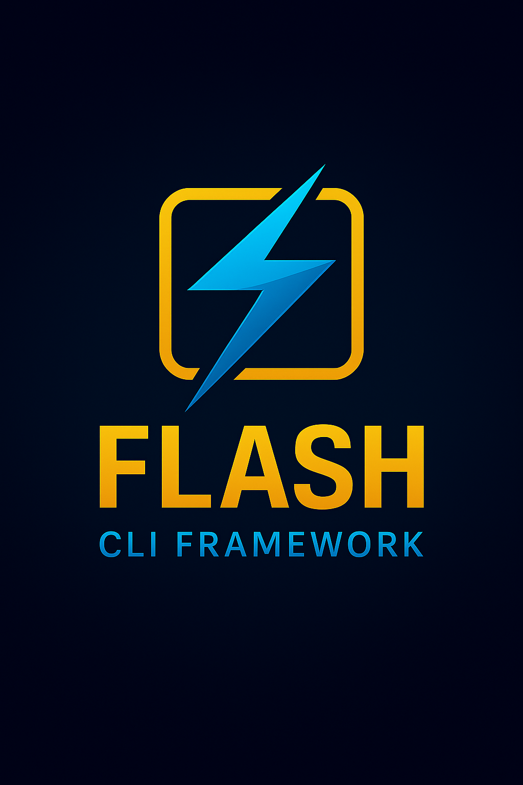

<div align="center">
  
</div>

# ⚡️ Flash — The Lightning-Fast CLI Framework for Zig

<div align="center">

[](https://ziglang.org/)
[](https://github.com/ghostkellz/flash)
[]()
[]()
[]()

</div>

---

### ⚡️**Flash** is the definitive CLI framework for Zig — inspired by Clap, Cobra, and structopt, but rebuilt for **next-generation async, idiomatic Zig**.

* **Blazing Fast:** Lightning startup, zero alloc CLI paths
* **Batteries Included:** Auto-generated help, subcommands, flags, shell completions
* **Async-First:** All parsing and dispatch is async (zsync-powered)
* **Declarative:** Use Zig's struct/enum power for arguments and commands
* **Error-Proof:** Predictable, type-safe, memory-safe; no panics, no segfaults
* **Plug & Play:** Works everywhere Zig runs—cross-compile in seconds

---

## 🚀 Why Flash?

* **Speed:** Near-zero overhead, built for CLI tools that *feel* instant
* **Ergonomics:** Clean, declarative CLI specs (no macros, no black magic)
* **Async-Ready:** Concurrency for file ops, shell completions, dynamic help
* **Modern Features:** Auto-complete, interactive prompts, config merging, and more
* **No Nonsense:** Pure Zig, no C glue, no runtime dependencies

---

## 🛠️ Features

* [x] **Subcommands:** Hierarchical, unlimited depth
* [x] **Flags & Options:** Typed, validated, defaulted
* [x] **Positional Arguments:** Required/optional, variadic
* [x] **Auto-Help:** `-h/--help` always works; custom banners supported
* [x] **Async Dispatch:** Each command/handler is a Zig async fn
* [x] **Shell Completion:** Bash, Zsh, Fish, PowerShell
* [x] **Config Integration:** Merge CLI, env, file config
* [x] **Interactive Prompts:** For passwords, choices, confirmation
* [x] **Rich Error Handling:** Usage, parse, and runtime errors, colorized output
* [x] **Unit-Testable:** Test your CLI as library code

---

## 📦 Quick Start

### Install

```sh
zig fetch github.com/ghostkellz/flash
```

*Or clone and add as a dependency in your `build.zig` project:*

```zig
const flash_dep = b.dependency("flash", .{ .target = target, .optimize = optimize });
const flash = flash_dep.module("flash");
```

### Minimal Example

```zig
const flash = @import("flash");

pub fn main() !void {
    const cli = flash.CLI(.{
        .name = "lightning",
        .version = "0.1.0",
        .about = "A demo CLI built with Flash",
        .commands = &.{
            flash.cmd("echo", .{
                .about = "Echo your message",
                .args = &.{
                    flash.arg("message", .{ .help = "Text to echo", .required = true }),
                },
                .run = async fn(ctx) {
                    std.debug.print("{s}\n", .{ctx.get("message").?});
                },
            }),
        },
    });

    try cli.run();
}
```

---

## 🔥 Advanced Features

* **Async Subcommands:** Spawn network/file ops in any handler
* **Dynamic Shell Completions:** Scriptable for your custom commands
* **Config/Env/Arg Precedence:** Build config flows declaratively
* **Prompt System:** Ask users for secrets/inputs interactively (optional)
* **Testing Helpers:** Inject args for CLI tests

---

## 🗺️ Roadmap

* [ ] Typed enums/options with auto-completion
* [ ] Custom validator hooks (async/inline)
* [ ] Plugin support (extend CLI at runtime)
* [ ] Command tree visualization
* [ ] Interactive REPL mode

---

## 🤝 Contributing

PRs, issues, feature ideas, and benchmarking challenges welcome!
See [`CONTRIBUTING.md`](CONTRIBUTING.md).

---

## 👻 Built by [GhostKellz](https://github.com/ghostkellz) — for a faster, saner Zig CLI world.

