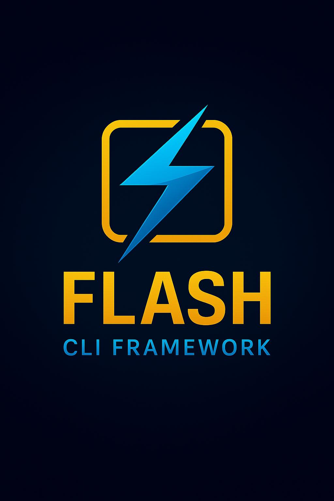

<div align="center">
  
</div>

# ⚡️ Flash — The Lightning-Fast CLI Framework for Zig

<p align="center">
  
  
  
  
</p>

---

### ⚡️**Flash** is the CLI framework for Zig `0.17.0-dev`, built to play the same role that Clap does in Rust and Cobra does in Go.

* **Blazing Fast:** Lightning startup, zero alloc CLI paths
* **Batteries Included:** Auto generated help, subcommands, flags, positional arguments
* **Macro-First And Declarative:** Use ergonomic command specs or Zig structs for arguments and commands
* **Error Proof:** Predictable, type safe, memory safe; no panics, no segfaults
* **Plug & Play:** Works everywhere Zig runs, cross compile in seconds

---

## ✅ Why Use Flash Now?

* **Rebaselined And Verified:** Flash is back on solid footing on the current Zig dev baseline with local, Docker, and Valgrind verification in place.
* **Bash/Zsh First-Class:** Completion is no longer a side feature. Bash is dynamic and command-aware, and Zsh gets recursive generated completion with value metadata.
* **Macro-First Without Hiding Zig:** Flash pushes ergonomic command specs and builders, but stays readable and explicit in normal Zig code.
* **Honest Surface Area:** Async execution, security storage, and YAML are not being oversold. Stable behavior is called out directly.

---

## 🚀 Why Flash?

* **Speed:** Near zero overhead, built for CLI tools that *feel* instant
* **Ergonomics:** Macro-first builders and declarative Zig APIs for expressive command trees
* **Modern Features:** Auto help, subcommands, typed arguments and flags
* **No Nonsense:** Pure Zig, no C glue, no runtime dependencies

---

## 🧭 Recommended Path

If you are evaluating Flash for a real project, start here:

1. Read the [Macro-First CLI example](docs/examples/macro-first.md)
2. Read [Getting Started](docs/guides/getting-started.md)
3. Read the [Shell Completions Guide](docs/guides/completions.md)
4. Read the [Flash + Flare Guide](docs/guides/flash-flare.md)
5. Run the Docker verification flow from [Docker Verification Guide](docs/guides/docker-verification.md)

---

## 🛠️ Features

### Stable
* [x] **Subcommands:** Hierarchical command structure with nested support
* [x] **Flags & Options:** Typed, validated, with defaults
* [x] **Positional Arguments:** Required/optional support
* [x] **Auto Help:** `-h/--help` generation
* [x] **Rich Error Handling:** Usage and parse errors with colorized output
* [x] **JSON Config:** Load configuration from JSON files
* [x] **TOML Config:** Load configuration from TOML files (via [flare](https://github.com/ghostkellz/flare))
* [x] **TOML Diagnostics:** Line/column parse diagnostics via Flare-backed config parsing
* [x] **Nested Subcommands:** Full command path resolution (e.g., `app service admin restart`)
* [x] **Shell Completion:** Bash, Zsh, Fish, PowerShell, NuShell generation
* [x] **Typed Enums/Choices:** Constrained argument values with validation and completion

### Experimental
* [🧪] **Interactive Prompts:** Password and choice prompts (visible input, demo-quality)
* [🧪] **Declarative API:** Struct-based CLI definition with `fieldname_config` metadata
* [🧪] **Macro Helpers:** Clap/Cobra-style `command()`, `cmd()`, `deriveCommand()` builders

### Internal Only (Not Exported)
* **Async Runtime:** Flash-owned async foundations back internal async handlers, validation, completion, and tooling, but are not public API yet
* **Security Module:** Credential storage withheld pending security audit

### Planned
* [ ] **YAML Config:** Explicitly unsupported in `v0.4.0`
* [ ] **Plugin Architecture:** Runtime CLI extension
* [ ] **Command Tree Visualization:** Visual command hierarchy display

---

## 📌 Support Policy

* Flash tracks the current Zig dev baseline used by the project and verified in CI-like local/Docker checks.
* Bash and Zsh are the strongest completion targets today.
* Fish is strong and recursive, but still behind Bash/Zsh in polish.
* PowerShell and NuShell are supported and recursive, but less feature-rich.
* Internal modules are not stability promises.

## 📊 Support Matrix

| Area | Status | Notes |
|------|--------|-------|
| Zig baseline | Supported | Zig `0.17.0-dev` |
| Linux | Verified | Local + Docker + Valgrind |
| macOS | Intended | Not verified in this workspace |
| Windows | Intended | Not verified in this workspace |
| Bash completion | First-class | Dynamic and command-aware |
| Zsh completion | First-class | Recursive generated completion |
| Fish completion | Supported | Recursive, less polished than Bash/Zsh |
| PowerShell | Supported | Recursive generated completion |
| NuShell | Supported | Recursive generated completion |
| Core CLI API | Stable | Recommended consumer path |
| Declarative API | Experimental | Prefer `parseWithArgs(...)` on this Zig baseline |
| Macro helpers | Experimental | Strong, but still evolving |
| Async internals | Internal-only | Real implementation, not public API |
| Security internals | Internal-only | Withheld pending audit |

---

## 📦 Quick Start

### Install

```sh
zig fetch github.com/ghostkellz/flash
```

*Or clone and add as a dependency in your `build.zig` project:*

```zig
const flash_dep = b.dependency("flash", .{ .target = target, .optimize = optimize });
const flash = flash_dep.module("flash");
```

### Minimal Example

```zig
const std = @import("std");
const flash = @import("flash");

pub fn main(init: std.process.Init) !void {
    const allocator = init.gpa;

    const EchoCLI = flash.CLI(.{
        .name = "echo-tool",
        .version = flash.version_string,
        .about = "A demo CLI built with Flash",
    });

    const echo_cmd = flash.cmd("echo", (flash.CommandConfig{})
        .withAbout("Echo your message")
        .withArgs(&.{
            flash.arg("message", (flash.ArgumentConfig{})
                .withHelp("Text to echo")
                .setRequired()),
        })
        .withHandler(echoHandler));

    var cli = EchoCLI.init(allocator, (flash.CommandConfig{})
        .withSubcommands(&.{echo_cmd}));

    try cli.runWithInit(init);
}

fn echoHandler(ctx: flash.Context) flash.Error!void {
    if (ctx.getString("message")) |message| {
        std.debug.print("{s}\n", .{message});
    }
}
```

---

## 🌟 Flagship Example

The recommended example is the macro-first command tree in [`docs/examples/macro-first.md`](docs/examples/macro-first.md).

It demonstrates the current strongest Flash story:

* macro-first command specs
* aliases and repeated values
* middleware composition
* nested command trees
* built-in shell completion generation
* clean path into Flare-backed config support

Example built-in completion usage:

```bash
flashctl completion bash > completions/flashctl.bash
flashctl completion zsh > completions/_flashctl
```

---

## 🔥 Advanced Features

* **Command Handlers:** Define handlers as regular Zig functions
* **Flag Chaining:** Builder pattern for ergonomic flag configuration
* **Macro-First Command Specs:** Build nested command trees with aliases, defaults, choices, and middleware composition
* **JSON Config Loading:** Merge file based configuration with CLI args
* **Nested Subcommands:** Full command path resolution for deep hierarchies
* **Prompt System:** Basic interactive prompts (experimental)

### Typed Enum/Choices Example

```zig
const format_arg = flash.arg("format", (flash.ArgumentConfig{})
    .withHelp("Output format")
    .withChoices(&.{ "json", "yaml", "toml" })
    .setRequired());

// Invalid choices are rejected with InvalidChoice error
// Shell completion suggests valid choices automatically
```

### Documentation

* [Installation Guide](docs/guides/installing-flash.md)
* [Migration Guide](docs/guides/migrating-to-0.4.md)
* [Declarative Config Guide](docs/guides/declarative-config.md)
* [Flash + Flare Guide](docs/guides/flash-flare.md)
* [Docker Verification Guide](docs/guides/docker-verification.md)
* [Shell Completions Guide](docs/guides/completions.md)
* [Getting Started](docs/guides/getting-started.md)

---

## ⚖️ Comparison

Flash is aiming for the same category position in Zig that Clap occupies in Rust and Cobra occupies in Go.

What Flash already does well:

* expressive command trees with nested subcommands and aliases
* generated help and shell completion
* typed args/flags with defaults and choices
* macro-first and declarative entry points
* config integration through Flare-backed TOML support

Where Flash is still more conservative than its long-term goal:

* async runtime execution is not public/stable yet
* YAML config is not supported yet
* security/credential storage remains intentionally withheld

---

## 🚧 Not Yet

These areas are intentionally not sold as complete:

* **Security Storage:** Still internal until a safer implementation is ready.
* **YAML Config:** Not in the current stable release scope.
* **Prompt Privacy:** Prompt support is experimental and password input is still visible.

---

## 🗺️ Roadmap

* [x] Nested subcommand resolution
* [x] Shell completion (Bash/Zsh first-class, Fish strong, PowerShell/NuShell recursive)
* [x] Typed enum options with auto-completion
* [x] TOML config file support (via flare)
* [x] TOML diagnostics via Flare parse context
* [ ] YAML config file support
* [ ] Security module with safe credential handling
* [ ] Plugin architecture for runtime extension
* [ ] Command tree visualization
* [ ] Interactive REPL mode

---

## 📋 v0.3.5 API Changes

The following modules were removed from the public API in v0.3.5:

| Module | Status | Reason | Reintroduction Criteria |
|--------|--------|--------|------------------------|
| `Async` | Internal | Flash-owned async foundations are still internal-only | Full async execution with tests |
| `Security` | Internal | Command injection vulnerabilities | Security audit and safe implementation |
| `flash-init` | Removed | Stale API incompatible with v0.3.x | Rewrite for v0.4.x API |

These modules still exist in the source but are not exported from `root.zig`.
Security surfaces still return `error.SecurityDisabled`, while async internals now use Flash's owned runtime but remain intentionally unexported.

---

## 🤝 Contributing

PRs, issues, feature ideas, and benchmarking challenges welcome!
See [`CONTRIBUTING.md`](CONTRIBUTING.md).

---
