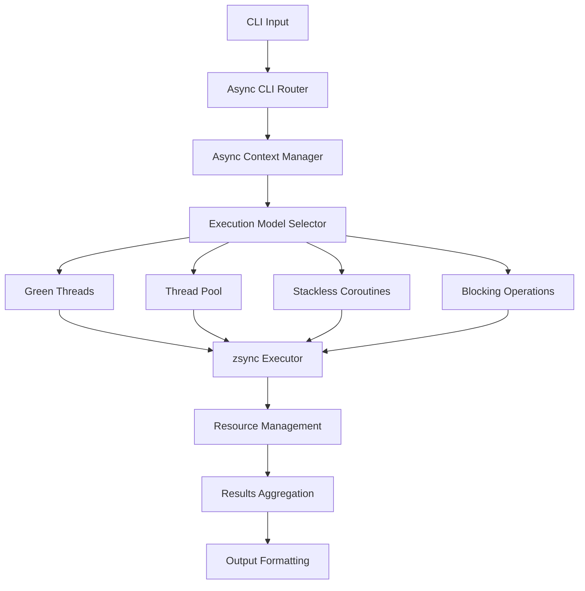

# ⚡ Flash Async System Architecture

Flash's async system is built on top of [zsync](https://github.com/kprotty/zsync), providing structured concurrency and high-performance async operations. This document details the async architecture and design decisions.

## 🎯 Design Goals

1. **Zero Runtime Overhead** - Async operations compile to efficient code
2. **Structured Concurrency** - All async operations are properly scoped
3. **Memory Safety** - No data races or memory leaks in async code
4. **Composability** - Async operations compose naturally
5. **Debuggability** - Clear error propagation and stack traces

## 🏗️ Architecture Overview



## 🔄 Execution Models

Flash automatically selects the optimal execution model based on workload characteristics:

### 1. **Green Threads** (I/O Bound)
```zig
// Automatic selection for I/O operations
async fn processFiles(ctx: flash.Context) !void {
    const files = ctx.getMany("files").?;

    // Flash detects I/O pattern and uses green threads
    var file_ops = flash.async_cli.AsyncFileOps.init(ctx.allocator);
    defer file_ops.deinit();

    const results = try file_ops.readFiles(files);
    // Process results...
}
```

### 2. **Thread Pool** (CPU Bound)
```zig
// Automatic selection for CPU-intensive operations
async fn encryptFiles(ctx: flash.Context) !void {
    const files = ctx.getMany("files").?;

    // Flash detects CPU-bound pattern and uses thread pool
    var crypto_ops = flash.async_cli.AsyncCryptoOps.init(ctx.allocator);
    defer crypto_ops.deinit();

    const results = try crypto_ops.encryptFiles(files, algorithm);
    // Process results...
}
```

### 3. **Stackless Coroutines** (Memory Constrained)
```zig
// Automatic selection for memory-constrained environments
async fn streamProcess(ctx: flash.Context) !void {
    const stream = ctx.get("input-stream").?;

    // Flash uses stackless coroutines for memory efficiency
    var processor = flash.async_cli.StreamProcessor.init(ctx.allocator);
    defer processor.deinit();

    try processor.processStream(stream, processChunk);
}
```

### 4. **Blocking Operations** (Simple Cases)
```zig
// Fallback to blocking for simple operations
fn simpleCommand(ctx: flash.Context) !void {
    // Flash uses blocking execution for simple commands
    const value = ctx.get("value").?;
    std.debug.print("Value: {s}\n", .{value});
}
```

## 🎪 Async Context Management

### Execution Context

```zig
pub const AsyncContext = struct {
    allocator: std.mem.Allocator,
    executor: zsync.Executor,
    futures: std.ArrayList(zsync.Future),
    results: std.ArrayList(AsyncResult),

    // Configuration
    timeout_ms: ?u64 = null,
    max_concurrency: usize = 10,
    memory_limit: ?usize = null,

    // Cancellation support
    cancellation_token: zsync.CancellationToken,

    // Resource tracking
    resource_tracker: ResourceTracker,
};
```

### Resource Management

```zig
const ResourceTracker = struct {
    open_files: std.ArrayList(std.fs.File),
    network_connections: std.ArrayList(NetworkConnection),
    allocated_memory: usize,

    pub fn cleanup(self: *ResourceTracker) void {
        // Automatic cleanup of all resources
        for (self.open_files.items) |file| {
            file.close();
        }
        for (self.network_connections.items) |conn| {
            conn.close();
        }
        // Memory is tracked by allocator
    }
};
```

## 🚀 Performance Optimizations

### 1. **Work Stealing**

```zig
// zsync's work-stealing scheduler
const WorkStealingExecutor = struct {
    threads: []Thread,
    work_queues: []WorkQueue,
    steal_attempts: std.atomic.Atomic(u64),

    pub fn spawn(self: *WorkStealingExecutor, func: anytype, args: anytype) !zsync.Future {
        const task = Task.create(func, args);

        // Try local queue first
        if (self.getCurrentQueue().tryPush(task)) {
            return task.future;
        }

        // Find least loaded queue
        const target_queue = self.findLeastLoadedQueue();
        try target_queue.push(task);

        return task.future;
    }

    fn stealWork(self: *WorkStealingExecutor, thief_id: usize) ?Task {
        // Work stealing algorithm
        var attempts: usize = 0;
        while (attempts < self.threads.len) {
            const victim_id = (thief_id + attempts + 1) % self.threads.len;
            if (self.work_queues[victim_id].trySteal()) |task| {
                self.steal_attempts.fetchAdd(1, .Monotonic);
                return task;
            }
            attempts += 1;
        }
        return null;
    }
};
```

### 2. **Memory Pool Management**

```zig
const AsyncMemoryPool = struct {
    task_pool: std.heap.MemoryPool(Task),
    future_pool: std.heap.MemoryPool(zsync.Future),
    context_pool: std.heap.MemoryPool(AsyncContext),

    // Pre-allocated buffers for common operations
    file_buffer_pool: BufferPool,
    network_buffer_pool: BufferPool,

    pub fn getTask(self: *AsyncMemoryPool) !*Task {
        return self.task_pool.create();
    }

    pub fn returnTask(self: *AsyncMemoryPool, task: *Task) void {
        task.reset();
        self.task_pool.destroy(task);
    }
};
```

### 3. **Zero-Copy Operations**

```zig
// Zero-copy file operations
async fn copyFileZeroCopy(src: []const u8, dst: []const u8) !void {
    const src_file = try std.fs.cwd().openFile(src, .{});
    defer src_file.close();

    const dst_file = try std.fs.cwd().createFile(dst, .{});
    defer dst_file.close();

    // Use sendfile or copy_file_range on Linux
    if (builtin.os.tag == .linux) {
        try std.os.sendfile(dst_file.handle, src_file.handle, null, src_file.getEndPos());
    } else {
        // Fallback to memory mapping
        const src_map = try std.os.mmap(
            null,
            src_file.getEndPos(),
            std.os.PROT.READ,
            std.os.MAP.PRIVATE,
            src_file.handle,
            0,
        );
        defer std.os.munmap(src_map);

        try dst_file.writeAll(src_map);
    }
}
```

## 🛡️ Error Handling and Cancellation

### Structured Error Propagation

```zig
const AsyncError = error{
    Timeout,
    Cancelled,
    ResourceExhausted,
    NetworkError,
    FilesystemError,
    ValidationError,
};

async fn resilientOperation(ctx: AsyncContext) AsyncError!Result {
    // Set up cancellation
    const cancellation_scope = try ctx.createCancellationScope();
    defer cancellation_scope.deinit();

    // Execute with timeout
    const timeout_future = zsync.sleep(ctx.timeout_ms orelse 30_000);
    const operation_future = actualOperation(ctx);

    const winner = try zsync.select(&.{ operation_future, timeout_future });
    return switch (winner) {
        0 => try operation_future.await(),
        1 => AsyncError.Timeout,
        else => unreachable,
    };
}
```

### Graceful Cancellation

```zig
async fn cancellableOperation(ctx: AsyncContext) !void {
    while (!ctx.isCancelled()) {
        // Check cancellation at regular intervals
        const chunk = try processNextChunk();

        // Cooperative cancellation point
        if (ctx.isCancelled()) {
            try cleanup();
            return;
        }

        try handleChunk(chunk);

        // Yield to other tasks
        try zsync.yield();
    }
}
```

## 📊 Monitoring and Observability

### Async Metrics Collection

```zig
const AsyncMetrics = struct {
    tasks_spawned: std.atomic.Atomic(u64),
    tasks_completed: std.atomic.Atomic(u64),
    tasks_cancelled: std.atomic.Atomic(u64),

    average_task_duration: std.atomic.Atomic(u64),
    peak_concurrency: std.atomic.Atomic(usize),

    work_steal_attempts: std.atomic.Atomic(u64),
    work_steal_successes: std.atomic.Atomic(u64),

    memory_peak: std.atomic.Atomic(usize),
    memory_current: std.atomic.Atomic(usize),

    pub fn recordTaskStart(self: *AsyncMetrics) void {
        _ = self.tasks_spawned.fetchAdd(1, .Monotonic);

        const current_tasks = self.tasks_spawned.load(.Monotonic) - self.tasks_completed.load(.Monotonic);
        self.updatePeakConcurrency(current_tasks);
    }

    pub fn recordTaskCompletion(self: *AsyncMetrics, duration_ns: u64) void {
        _ = self.tasks_completed.fetchAdd(1, .Monotonic);
        self.updateAverageDuration(duration_ns);
    }

    pub fn generateReport(self: AsyncMetrics, allocator: std.mem.Allocator) ![]u8 {
        return std.fmt.allocPrint(allocator,
            \\Async Performance Report:
            \\  Tasks: {} spawned, {} completed, {} cancelled
            \\  Average Duration: {d:.2}ms
            \\  Peak Concurrency: {}
            \\  Work Stealing: {}/{} success rate
            \\  Memory: {} peak, {} current
        , .{
            self.tasks_spawned.load(.Monotonic),
            self.tasks_completed.load(.Monotonic),
            self.tasks_cancelled.load(.Monotonic),
            @as(f64, @floatFromInt(self.average_task_duration.load(.Monotonic))) / 1_000_000.0,
            self.peak_concurrency.load(.Monotonic),
            self.work_steal_successes.load(.Monotonic),
            self.work_steal_attempts.load(.Monotonic),
            self.memory_peak.load(.Monotonic),
            self.memory_current.load(.Monotonic),
        });
    }
};
```

## 🔧 Integration with CLI Framework

### Async Command Registration

```zig
// Compile-time async command detection
pub fn cmd(comptime name: []const u8, comptime config: CommandConfig) Command {
    const has_async_handler = @hasField(@TypeOf(config), "run_async");
    const has_sync_handler = @hasField(@TypeOf(config), "run");

    comptime {
        if (has_async_handler and has_sync_handler) {
            @compileError("Command cannot have both sync and async handlers");
        }
        if (!has_async_handler and !has_sync_handler) {
            @compileError("Command must have either sync or async handler");
        }
    }

    return Command{
        .name = name,
        .config = config,
        .handler_type = if (has_async_handler) .async else .sync,
    };
}
```

### Runtime Async Dispatch

```zig
pub fn executeCommand(command: Command, ctx: Context) !void {
    switch (command.handler_type) {
        .sync => try command.config.run(ctx),
        .async => {
            var async_ctx = AsyncContext.init(ctx.allocator);
            defer async_ctx.deinit();

            const future = try async_ctx.executor.spawn(command.config.run_async, .{ctx});
            try future.await();
        },
    }
}
```

## 🎯 Best Practices

### 1. **Resource Scoping**
```zig
async fn properResourceManagement(ctx: AsyncContext) !void {
    var resource_scope = try ctx.createResourceScope();
    defer resource_scope.cleanup(); // Guaranteed cleanup

    const file = try resource_scope.openFile("data.txt");
    const connection = try resource_scope.connectTcp("api.example.com:443");

    // Resources automatically cleaned up on scope exit
}
```

### 2. **Backpressure Handling**
```zig
async fn handleBackpressure(ctx: AsyncContext) !void {
    var semaphore = zsync.Semaphore.init(max_concurrent_operations);
    defer semaphore.deinit();

    for (work_items) |item| {
        try semaphore.acquire(); // Blocks when limit reached

        const future = try ctx.executor.spawn(processItem, .{item, &semaphore});
        // Don't await here - let it run concurrently
    }

    // Wait for all to complete
    try ctx.waitForAll();
}
```

### 3. **Error Recovery**
```zig
async fn withRetryLogic(ctx: AsyncContext, operation: anytype) !Result {
    var retries: usize = 0;
    const max_retries = 3;

    while (retries < max_retries) {
        switch (try operation(ctx)) {
            .success => |result| return result,
            .retry => |err| {
                retries += 1;
                const delay = @min(1000 * (@as(u64, 1) << @intCast(retries)), 30_000);
                try zsync.sleep(delay);
                continue;
            },
            .fail => |err| return err,
        }
    }

    return error.MaxRetriesExceeded;
}
```

## 🔮 Future Enhancements

### 1. **Adaptive Execution**
- Runtime profiling of workload characteristics
- Dynamic switching between execution models
- Machine learning for optimal concurrency levels

### 2. **Distributed Async**
- Multi-machine task distribution
- Fault-tolerant async operations
- Network-aware scheduling

### 3. **Advanced Profiling**
- Async flame graphs
- Task dependency visualization
- Performance regression detection

---

*Flash's async system provides a solid foundation for building high-performance CLI applications that can handle complex concurrent operations efficiently and safely.*