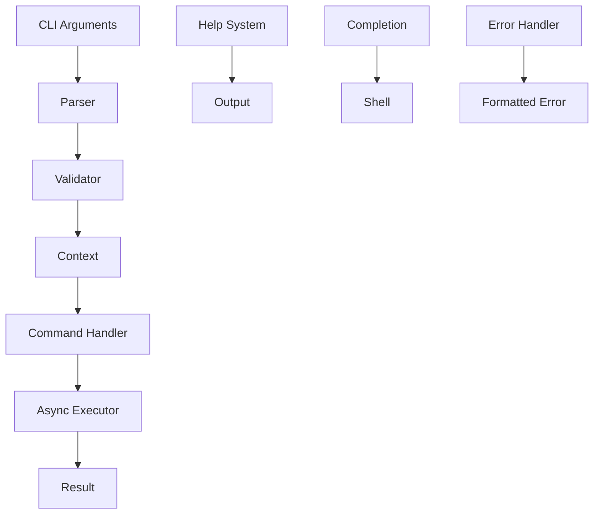
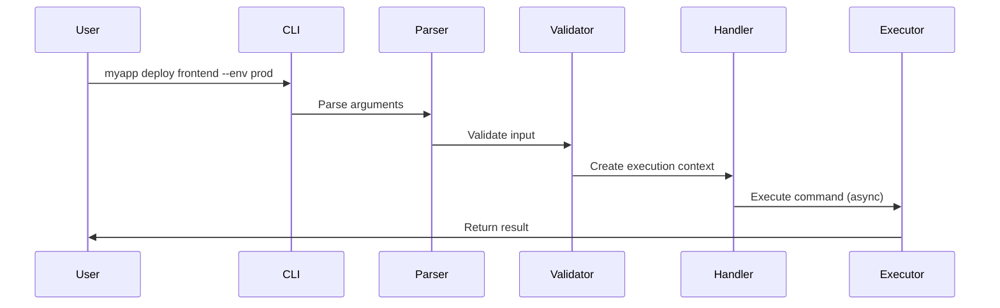
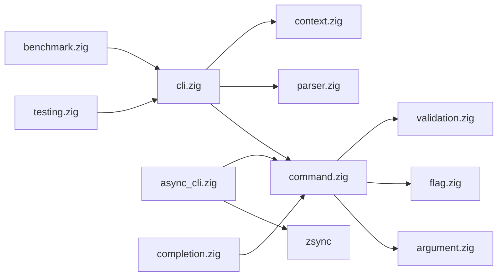

# 🏗️ Flash CLI Architecture & Structure

Flash is designed with a modular, composable architecture that prioritizes performance, safety, and developer experience. This document outlines the core architectural decisions and structure.

## 🎯 Design Principles

### 1. **Async-First**
- All operations designed for concurrency
- Non-blocking I/O by default
- Structured concurrency with zsync

### 2. **Zero-Cost Abstractions**
- Compile-time code generation
- No runtime overhead for unused features
- Memory-efficient data structures

### 3. **Type Safety**
- Compile-time validation
- Strong typing throughout
- Error-prone operations made explicit

### 4. **Composability**
- Modular components
- Reusable building blocks
- Clear separation of concerns

## 🧱 Core Components

```
flash/
├── src/
│   ├── cli.zig              # Main CLI interface
│   ├── command.zig          # Command definitions
│   ├── argument.zig         # Argument parsing
│   ├── flag.zig            # Flag handling
│   ├── context.zig         # Execution context
│   ├── help.zig            # Help generation
│   ├── error.zig           # Error handling
│   ├── validation.zig       # Basic validation
│   ├── advanced_validation.zig  # Rich validation
│   ├── completion.zig       # Shell completions
│   ├── testing.zig         # Testing infrastructure
│   ├── documentation.zig   # Doc generation
│   ├── async_cli.zig       # Async operations
│   ├── benchmark.zig       # Performance testing
│   └── root.zig           # Public API
```

## 🔄 Data Flow



### 1. **Input Processing**
```zig
// Raw arguments → Structured data
const args = std.process.argsAlloc(allocator);
const parsed = try parser.parse(args);
const validated = try validator.validate(parsed);
```

### 2. **Context Creation**
```zig
// Create execution context
var context = Context.init(allocator);
context.setArgs(validated.args);
context.setFlags(validated.flags);
context.setCommand(validated.command);
```

### 3. **Command Execution**
```zig
// Execute command (sync or async)
const result = switch (command.handler_type) {
    .sync => command.run(context),
    .async => try command.run_async(context),
};
```

## 🎪 Command Architecture

### Command Hierarchy

```zig
const RootCommand = flash.CLI(.{
    .name = "myapp",
    .commands = &.{
        // Subcommand with nested structure
        flash.cmd("deploy", .{
            .about = "Deploy applications",
            .commands = &.{
                flash.cmd("frontend", .{
                    .about = "Deploy frontend app",
                    .run_async = deployFrontend,
                }),
                flash.cmd("backend", .{
                    .about = "Deploy backend service",
                    .run_async = deployBackend,
                }),
            },
        }),

        // Simple command
        flash.cmd("status", .{
            .about = "Check application status",
            .run = checkStatus,
        }),
    },
});
```

### Command Lifecycle



## 📦 Module Dependencies



### Core Dependencies
- **zsync**: Async runtime and structured concurrency
- **std**: Zig standard library
- **No external C dependencies**

## 🎭 Type System Integration

### Compile-Time Configuration

```zig
pub fn CLI(comptime config: CLIConfig) type {
    return struct {
        const Self = @This();

        // Generate command tree at compile time
        const command_tree = comptime buildCommandTree(config.commands);

        // Generate parser at compile time
        const parser = comptime generateParser(command_tree);

        // Generate help system at compile time
        const help = comptime generateHelp(command_tree);

        pub fn run(self: Self) !void {
            // Runtime execution with compile-time optimizations
        }
    };
}
```

### Type-Safe Arguments

```zig
// Compile-time argument validation
const MyCommand = flash.cmd("build", .{
    .args = &.{
        flash.arg("target", .{
            .type = []const u8,
            .required = true,
            .validator = targetValidator,
        }),
        flash.arg("optimize", .{
            .type = OptimizeMode,
            .default = .Debug,
        }),
    },
});

// Type-safe access in handler
fn buildHandler(ctx: flash.Context) !void {
    const target: []const u8 = ctx.get("target").?; // Cannot be null
    const optimize: OptimizeMode = ctx.get("optimize").?; // Typed access
}
```

## 🚀 Performance Architecture

### Zero-Allocation Paths

```zig
// Command execution without allocations for simple cases
pub fn fastPath(comptime cmd: Command) fn() void {
    return struct {
        fn execute() void {
            // No dynamic allocation needed
            comptime {
                validateCommandAtCompileTime(cmd);
            }
            // Direct execution
        }
    }.execute;
}
```

### Memory Pool Management

```zig
// Specialized allocators for different use cases
const CLIAllocators = struct {
    // Arena for temporary parsing data
    parsing_arena: std.heap.ArenaAllocator,

    // Pool for command contexts
    context_pool: std.heap.MemoryPool(Context),

    // General purpose allocator
    general: std.mem.Allocator,

    pub fn init(backing: std.mem.Allocator) CLIAllocators {
        return .{
            .parsing_arena = std.heap.ArenaAllocator.init(backing),
            .context_pool = std.heap.MemoryPool(Context).init(backing),
            .general = backing,
        };
    }
};
```

## 🔄 Async Architecture

### Execution Models

Flash supports multiple execution models:

```zig
pub const ExecutionModel = enum {
    blocking,        // Traditional synchronous execution
    thread_pool,     // Thread pool for CPU-bound tasks
    green_threads,   // Lightweight threads for I/O
    stackless,       // Stackless coroutines
    auto,           // Auto-detect optimal model
};
```

### Async Command Handlers

```zig
// Async command with structured concurrency
async fn processFiles(ctx: flash.Context) !void {
    const files = ctx.getMany("files").?;

    // Process files concurrently with bounded parallelism
    var semaphore = zsync.Semaphore.init(ctx.get("concurrency") orelse 4);
    defer semaphore.deinit();

    var tasks = std.ArrayList(zsync.Task(ProcessResult)).init(ctx.allocator);
    defer tasks.deinit();

    for (files) |file| {
        const task = try zsync.spawn(processFile, .{file, &semaphore});
        try tasks.append(task);
    }

    // Wait for all tasks to complete
    for (tasks.items) |task| {
        const result = try task.await();
        handleResult(result);
    }
}
```

## 🛡️ Error Handling Architecture

### Error Classification

```zig
pub const FlashError = error{
    // Parse errors
    InvalidArgument,
    MissingRequired,
    TooManyArguments,

    // Validation errors
    ValidationFailed,
    InvalidValue,
    OutOfRange,

    // Runtime errors
    CommandFailed,
    Timeout,
    Cancelled,

    // System errors
    FileNotFound,
    PermissionDenied,
    NetworkError,
};
```

### Error Context

```zig
pub const ErrorContext = struct {
    error_type: FlashError,
    message: []const u8,
    location: SourceLocation,
    context: []const u8,
    suggestions: []const []const u8,

    pub fn print(self: ErrorContext, writer: anytype, colors: bool) !void {
        // Rich error formatting with colors and suggestions
    }
};
```

## 🔌 Plugin Architecture

### Extension Points

```zig
pub const PluginInterface = struct {
    // Custom validators
    validators: []const ValidatorPlugin,

    // Custom completers
    completers: []const CompleterPlugin,

    // Custom output formatters
    formatters: []const FormatterPlugin,

    // Custom command processors
    processors: []const ProcessorPlugin,
};
```

### Plugin Registration

```zig
// Register plugins at compile time
const cli = flash.CLI(.{
    .name = "myapp",
    .plugins = &.{
        @import("plugins/json_validator.zig"),
        @import("plugins/yaml_completer.zig"),
        @import("plugins/table_formatter.zig"),
    },
});
```

## 📊 Metrics and Observability

### Built-in Metrics

```zig
pub const Metrics = struct {
    parse_time_ns: u64,
    validation_time_ns: u64,
    execution_time_ns: u64,
    memory_peak_bytes: usize,
    allocations_count: usize,

    pub fn collect(comptime enable: bool) ?Metrics {
        if (!enable) return null;

        return Metrics{
            // Collect metrics during execution
        };
    }
};
```

## 🔧 Build System Integration

### Compile-Time Code Generation

```zig
// Generate completion scripts at build time
pub fn build(b: *std.Build) void {
    const exe = b.addExecutable(.{
        .name = "myapp",
        .root_source_file = .{ .path = "src/main.zig" },
    });

    // Generate completions
    const completions = b.addRunArtifact(exe);
    completions.addArg("completion");
    completions.addArg("--generate-all");
    completions.addArg("--output-dir");
    completions.addArg("completions/");

    b.getInstallStep().dependOn(&completions.step);
}
```

## 🎯 Testing Architecture

### Multi-Level Testing

```zig
// Unit tests for individual components
test "argument parsing" {
    // Test argument parser in isolation
}

// Integration tests for command execution
test "command integration" {
    var harness = flash.testing.TestHarness.init(allocator);
    defer harness.deinit();

    const result = try harness.execute(myApp, &.{"command", "arg"});
    try result.expectSuccess();
}

// Performance tests
test "performance benchmarks" {
    var benchmark = flash.benchmark.BenchmarkRunner.init(allocator, .{});
    defer benchmark.deinit();

    _ = try benchmark.benchmark("command_execution", executeCommand, .{});
}
```

## 🔮 Future Architecture Considerations

### 1. **WebAssembly Support**
- Compile CLI tools to WASM
- Run in browsers or edge environments
- Shared validation logic

### 2. **Language Server Protocol**
- CLI-as-a-service
- Real-time validation in editors
- Interactive development

### 3. **Distributed Execution**
- Run commands across multiple machines
- Coordinate complex deployments
- Fault-tolerant execution

---

*Flash's architecture prioritizes performance, safety, and developer experience while remaining flexible and extensible.*